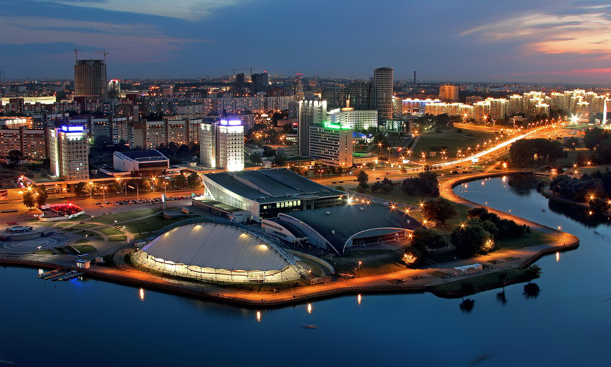

# Мой отпуск

## Поеду в **Австралию**

Австралия является одной из развитых стран, будучи тринадцатой по размеру экономикой в мире, и имеет шестое место в мире по ВВП в расчёте на душу населения. Военные расходы Австралии являются двенадцатыми по размеру в мире. Со вторым по величине индексом развития человеческого потенциала Австралия занимает высокое место во многих сферах, таких как качество жизни, здоровье, образование, экономическая свобода, защита гражданских свобод и политических прав.
Когда же он определит что тут что-то есть?
git merge странная работа

>[Геолокация](https://yandex.by/maps/?ll=116.164042%2C-35.237191&mode=search&ol=geo&ouri=ymapsbm1%3A%2F%2Fgeo%3Fdata%3DCgoyMjM5MzQzODE4EglBdXN0cmFsaWEiCg2fywVDFeaOzcE%3D&z=3.7)

<br>

```
ЗДЕСЬ БЫЛ КЕНГУРУ
```
____

## Планирую посетить **ОАЭ**
Государство ОАЭ расположено в юго-западной части Азии, восточной части Аравийского полуострова. Граничит с Саудовской Аравией на западе и юге, с Оманом — на юго-востоке и на северо-востоке (оманский полуанклав губернаторство Мусандам и его полный анклав, вилайет Мусандама Мадха). Омывается водами Персидского и Оманского заливов.

>[Геолокация](https://yandex.by/maps/?ll=54.035798%2C24.388821&mode=search&ol=geo&ouri=ymapsbm1%3A%2F%2Fgeo%3Fdata%3DCgoxNTIwMDA1NDExEi7Yp9mE2KXZhdin2LHYp9iqINin2YTYudix2KjZitipINin2YTZhdiq2K3Yr9ipIgoNdTpYQhVv0rxB&z=7.79)

<br>


___

## Вернусь в любимый **_дом_**
Белору́ссия, также Белару́сь (белор. Беларусь,  Информация о файле слушать), официальное название — Респу́блика Белару́сь (белор. Рэспубліка Беларусь, [rɛsˈpublʲika bʲɛlaˈrusʲ] Информация о файле слушать, аббревиатура — РБ), — государство в Восточной Европе. Население на 1 января 2022 года составляет 9 255 524 человек, территория — 207 595 км². Занимает 94-е место по количеству населенияПерейти к разделу «#Население» и 84-е по территории в мире.

>[Геолокация](https://yandex.by/maps/?ll=27.701393%2C52.858248&z=7)

<br>



